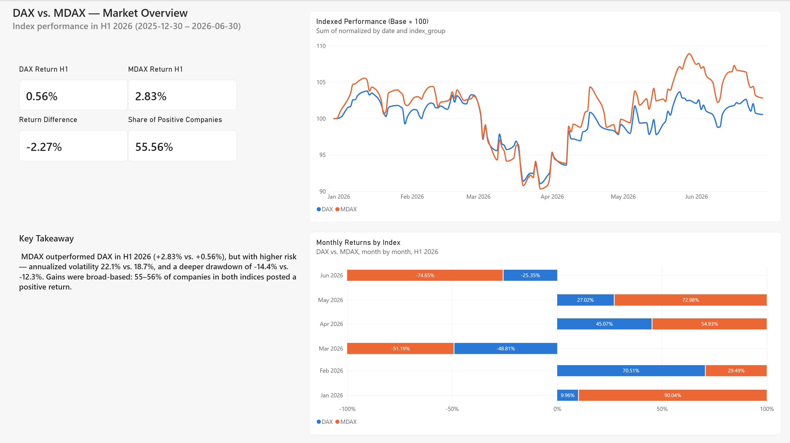
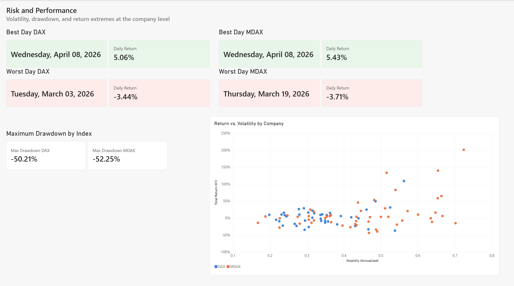
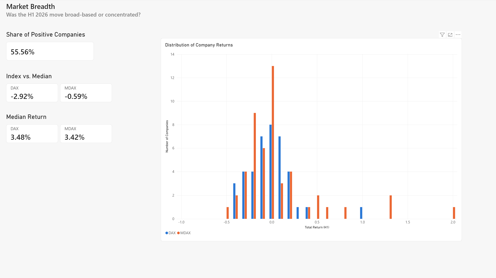
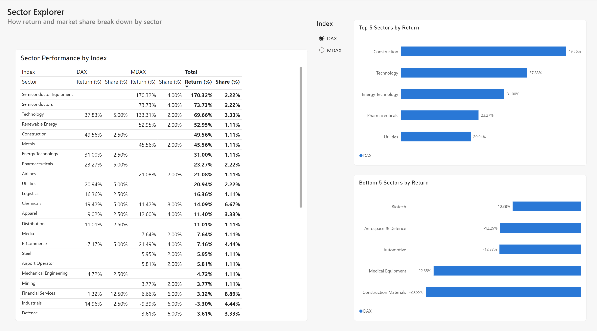
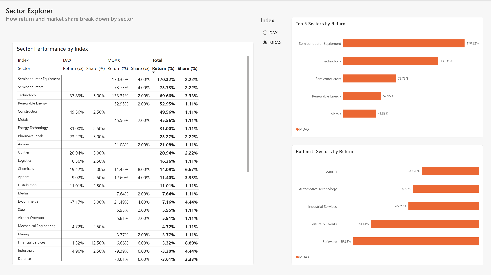
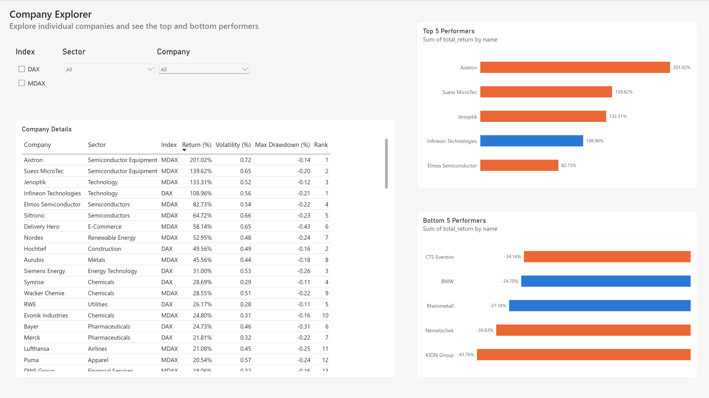
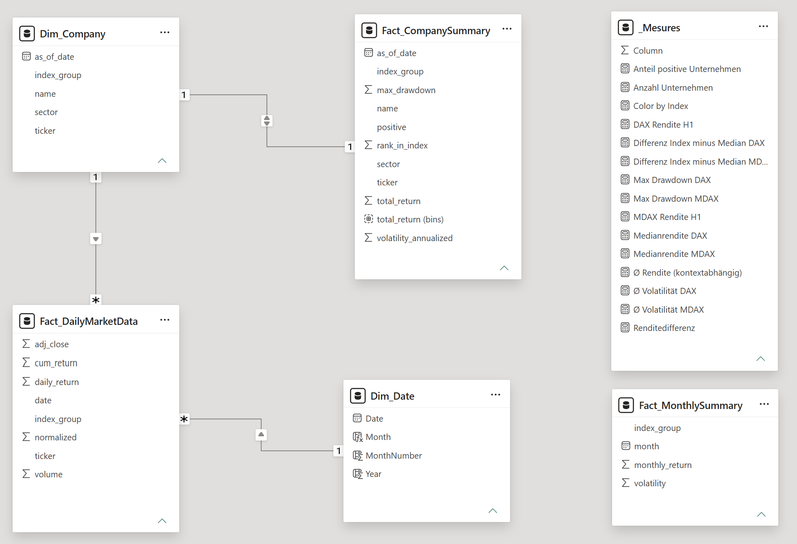

# DAX vs. MDAX — Analyse des deutschen Aktienmarkts (H1 2026)

*[English version](README.md)*

Ein Data-Analytics-Portfolioprojekt, das die Performance, das Risiko und die Marktbreite der beiden wichtigsten deutschen Aktienindizes — **DAX** (40 Large-Cap-Werte) und **MDAX** (50 Mid-Cap-Werte) — im ersten Halbjahr 2026 (30.12.2025 bis 30.06.2026) vergleicht.

Das Projekt besteht aus zwei Teilen:
1. Einem **Python/Jupyter-Notebook** ([`dax_mdax_analysis.ipynb`](dax_mdax_analysis.ipynb)), das tägliche Kursdaten für beide Indizes und ihre Mitglieder abruft, bereinigt und analysiert.
2. Einem **Power-BI-Dashboard**, das auf den Ergebnissen des Notebooks aufbaut, mit 5 Seiten zur interaktiven Erkundung.

## Wichtigste Ergebnisse

- **Rendite:** Der MDAX schlug den DAX im H1 2026 (**+2,83 %** vs. **+0,56 %**, Differenz **-2,27 Prozentpunkte**).
- **Risiko:** Der MDAX trug ein höheres Risiko — annualisierte Volatilität von **22,1 %** vs. **18,7 %** beim DAX. Beim maximalen Drawdown muss man zwei Ebenen unterscheiden: auf **Indexebene** (die Kursreihe des Index selbst) lag er bei **-14,4 %** (MDAX) vs. **-12,3 %** (DAX); auf **Einzelwertebene** (das schwächste einzelne Unternehmen innerhalb des jeweiligen Index) lag er bei **-52,25 %** (MDAX) vs. **-50,21 %** (DAX). Die "Max Drawdown"-Karten im Power-BI-Dashboard zeigen die Einzelwertebene.
- **Marktbreite:** Die Gewinne waren breit gestreut, nicht auf wenige Werte konzentriert — **55–56 %** der Unternehmen in beiden Indizes verzeichneten eine positive H1-Rendite.
- **Extremwerte:** Die stärksten Performer waren Aixtron (**+201,0 %**, MDAX) und Infineon Technologies (**+108,96 %**, DAX). Die schwächsten waren KION Group (**-43,8 %**, MDAX) und Rheinmetall (**-37,2 %**, DAX).
- **Hinweis zur Indexzusammensetzung:** Hochtief wechselte am 22.06.2026 in den DAX und ersetzte Porsche SE, die in den MDAX wechselte. Beide Indizes werden mit ihrer Zusammensetzung nach diesem Wechsel modelliert (DAX: 40 / MDAX: 50).

In diesem Projekt wurde keine Marktkapitalisierungsgewichtung berechnet — daher werden keine Aussagen darüber getroffen, welche einzelnen Unternehmen die Indexperformance konkret getrieben haben. Die obigen Ergebnisse beschreiben ausschließlich die Daten auf Unternehmensebene.

## Daten & Methodik

- **Quelldaten:** tägliche OHLC-Kursdaten für den DAX-Index, den MDAX-Index und alle einzelnen Mitgliedsunternehmen beider Indizes, für den Zeitraum 30.12.2025 bis 30.06.2026.
- **Verarbeitung:** bereinigt und forward-filled in Python (pandas), mit abgeleiteten Kennzahlen je Unternehmen: Gesamtrendite, annualisierte Volatilität, maximaler Drawdown und Rang innerhalb des Index.
- **Exporte:** vier CSV-Dateien speisen das Power-BI-Modell —
  - `daily_market_data.csv` — tägliche Kurse und Renditen, Indizes und Einzelwerte
  - `company_metadata.csv` — Firmenname, Sektor, Indexzugehörigkeit, Ticker
  - `company_summary.csv` — H1-Kennzahlen je Unternehmen (Rendite, Volatilität, Drawdown, Rang)
  - `monthly_summary.csv` — monatliche Renditen je Index

## Power-BI-Dashboard

Das Dashboard nutzt ein Sternschema (`Dim_Company`, `Dim_Date`, `Fact_DailyMarketData`, `Fact_CompanySummary`, `Fact_MonthlySummary`) und ist auf 5 Seiten aufgebaut:

| Seite | Inhalt |
|---|---|
| **1. Market Overview** | Indexierte Performance (Basis = 100), H1-Rendite-KPIs, monatliche Renditen je Index |
| **2. Risk and Performance** | Bester/schlechtester Handelstag je Index, maximaler Drawdown, Rendite vs. Volatilität je Unternehmen |
| **3. Market Breadth** | Anteil positiver Unternehmen, Index vs. Median-Rendite, Verteilung der Unternehmensrenditen |
| **4. Sector Explorer** | Rendite und Marktanteil je Sektor, aufgeteilt nach DAX/MDAX, Top/Bottom 5 Sektoren |
| **5. Company Explorer** | Vollständige Unternehmenstabelle mit Filtern (Index, Sektor, Unternehmen), Top/Bottom 5 Performer |

### Screenshots

#### 1. Market Overview
Indexierte Performance (Basis = 100) für DAX vs. MDAX im gesamten H1 2026, zentrale Rendite-KPIs und monatliche Renditen je Index.

#### 2. Risk and Performance
Bester/schlechtester einzelner Handelstag je Index, maximaler Drawdown als Karten, sowie ein Streudiagramm mit Rendite vs. Volatilität für jedes Unternehmen.

#### 3. Market Breadth
Anteil der Unternehmen mit positiver H1-Rendite, Index-Rendite vs. Median-Rendite, sowie ein Histogramm zur Verteilung der Unternehmensrenditen.

#### 4. Sector Explorer (DAX)
Top 5 / Bottom 5 Sektoren nach Rendite für den ausgewählten Index, plus eine Matrix, die Rendite und Marktanteil je Sektor für DAX und MDAX nebeneinander vergleicht. Index-Slicer auf DAX gesetzt.

#### 5. Sector Explorer (MDAX)
Dieselbe Seite wie oben, mit dem Index-Slicer auf MDAX umgeschaltet — zeigt die eigenen Top/Bottom-Sektoren des MDAX, während die Matrix unten weiterhin beide Indizes zeigt.

#### 6. Company Explorer
Vollständige Unternehmenstabelle, filterbar nach Index, Sektor und Unternehmen, plus Top-5-/Bottom-5-Performer-Diagramme.

#### 7. Datenmodell (Sternschema)
Das Power-BI-Datenmodell: `Dim_Company`, `Dim_Date`, `Fact_DailyMarketData`, `Fact_CompanySummary`, `Fact_MonthlySummary` und ihre Beziehungen zueinander.

## Tools

- Python (pandas, Jupyter)
- Power BI (DAX, Power Query, Datenmodellierung)
- Claude (Anthropic) — als KI-Assistent während der Entwicklung genutzt (Debugging, Dokumentation)

## Autor

Amir ([@Amirhouschang](https://github.com/Amirhouschang))
